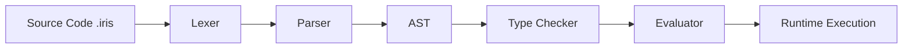

# Iris Architecture Guide

This document provides a technical overview of the Iris language implementation (v0.5.0). It is intended to help contributors understand the system structure and avoid breaking changes.

## 1. System Overview

Iris is currently implemented as a tree-walking interpreter in TypeScript. The pipeline consists of three main stages:

## 2. Core Components

### 2.1 Lexer & Parser (`src/sexp.ts`)
*   **Lexer**: Converts raw strings into a flat list of `Token` objects (LParen, RParen, Symbol, Str, Int, etc.). It handles basic syntax like comments and string escapes.
*   **Parser**: Consumes tokens to build an Abstract Syntax Tree (AST). It handles S-expression structure (`(op args...)`).
    *   **Special Forms**: `let`, `if`, `match`, `def`, `type` are handled specifically during parsing to create distinct AST node types.
    *   **Fallback**: Unknown forms are parsed as generic `Call` nodes (function calls).

### 2.2 Abstract Syntax Tree (`src/types.ts`)
The AST is defined by the `Expr` union type. Key nodes include:
*   `Literal`: Wrapper for distinct value types (I64, Bool, Str).
*   `Call`: Function application `(fn args...)`.
*   `Intrinsic`: Built-in operations (e.g., `+`, `io.print`) identified by string opcodes.
*   `Let`, `If`, `Match`: Control flow structures.
*   `DefFn`, `DefConst`: Top-level definitions.

### 2.3 Type Checker (`src/typecheck.ts`)
Performs static analysis before execution.
*   **Two-Pass System**:
    1.  **Header Scan**: Collects all type and function signatures.
    2.  **Body Check**: Verifies function bodies against signatures.
*   **Effect System**: Verifies effect labels (e.g., `!Pure`, `!IO`, `!Net`).
*   **Type Compatibility**: Structural typing for Records, Nominal for specific named types.

### 2.4 Evaluator (`src/eval.ts`)
The `Interpreter` class executes the AST.
*   **Environment**: Manages variable scopes and values.
*   **Direct Execution**: AST nodes are visited and executed recursively.
*   **Intrinsic Dispatch**: The core "standard library" is implemented via the `evalIntrinsic` method, which switches on the intrinsic name (e.g., `http.get`, `map.put`) and executes TypeScript code.

## 3. Data Structures

### Values (`src/types.ts`)
Runtime values are represented by the `Value` discriminated union:
*   `kind: 'I64'`: BigInt wrappers (e.g., `{ kind: 'I64', value: 10n }`).
*   `kind: 'Str'`, `kind: 'Bool'`: Primitive wrappers.
*   `kind: 'List'`, `kind: 'Tuple'`, `kind: 'Record'`: Collection types.
*   `kind: 'Tagged'`: Represents Union variants (e.g., `(tag "Some" value)`).
*   `kind: 'Map'`: Wraps a native JS `Map`, but keys are serialized strings (e.g., `"I64:10"`, `"Str:key"`) to strict value semantics.

## 4. Concurrency Model (`src/runtime/process.ts`)
Iris uses an Actor model for concurrency.
*   **Process**: An isolated unit of execution with its own Interpreter instance.
*   **Mailbox**: Each process has a message queue.
*   **Intrinsics**: `sys.spawn`, `sys.send`, `sys.recv` manage process lifecycle and communication.

## 5. Build & Test
*   **Source**: `src/*.ts` (TypeScript).
*   **Distribution**: `dist/*.js` (Compiled JavaScript).
*   **Entry Point**: `bin/iris` executes `dist/src/cli.js`.
*   **Testing**: `npm test` runs `ts-node src/tests.ts`, executing tests defined in `tests/*.ts`.
